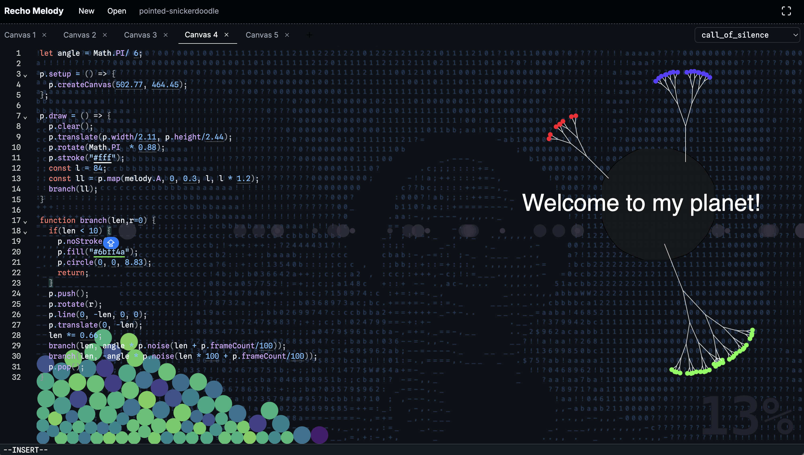

# WIP: Recho Melody

> A chronological editor for coding with piano.

Code and music have something in common: graphical music scores guide musical activity in time, and code executes in time in unique ways.

This also means that pianists and coders have something in common: when they press the keys, things come to life. One creates sound, the other creates visuals. **What if both happened together? Let's see—and listen.**

## Getting Started

1. Start coding in the editor on the left
2. Watch the piano notes fall as you type
3. `Cmd/Ctrl + S` to save your code and run the sketch
4. Create visual sketches that respond to the melody
5. Select different pieces from the dropdown to change the music

## Features

- Piano notes automatically play and fall down as you type
- You can create multiple canvases in one sketch
- `Cmd/Ctrl + Drag` to reorder canvases
- `Cmd/Ctrl` to show the outline of the canvas
- Use `melody.A` to access the current note's amplitude
- Drag sliders on numbers to adjust values interactively
- Click color values to open the color picker
- `Cmd/Ctrl + O/o` to display your face as the background

## Shortcuts

### File Management

- `Cmd/Ctrl + B` - Create new file
- `Cmd/Ctrl + ←` - Previous file
- `Cmd/Ctrl + →` - Next file

### Editor

- `Cmd/Ctrl + S` - Save
- `Cmd/Ctrl + M` - Move note circles down
- `jj` - Escape (Vim mode)

### Pieces & Templates

- `Cmd/Ctrl + I` - Switch piece
- `Cmd/Ctrl + Shift + 1-2, 9-0` - Code templates

### Visual Modes

- `Cmd/Ctrl + O` - Toggle ASCII mode
- `Cmd/Ctrl + Shift + O` - Toggle normal mode
